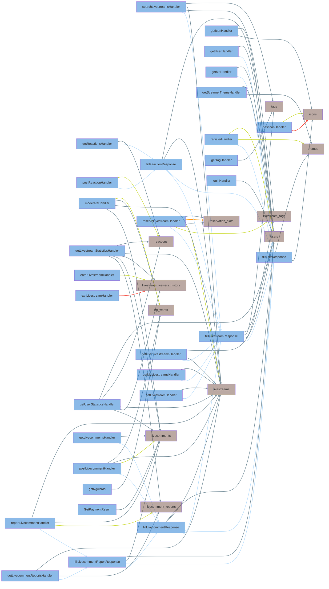

# DB Graph
node:  `テーブル`  `関数` 

edge:  `INSERT`  `UPDATE`  `DELETE`  `SELECT`  `関数呼び出し` 

```mermaid
graph LR
  classDef table fill:#795548,fill-opacity:0.5
  classDef func fill:#1976D2,fill-opacity:0.5
  func:github.com/isucon/isucon13/webapp/go.searchLivestreamsHandler[searchLivestreamsHandler]:::func --> func:github.com/isucon/isucon13/webapp/go.fillLivestreamResponse[fillLivestreamResponse]:::func
  func:github.com/isucon/isucon13/webapp/go.searchLivestreamsHandler[searchLivestreamsHandler]:::func --> table:livestream_tags[livestream_tags]:::table
  func:github.com/isucon/isucon13/webapp/go.searchLivestreamsHandler[searchLivestreamsHandler]:::func --> table:livestreams[livestreams]:::table
  func:github.com/isucon/isucon13/webapp/go.searchLivestreamsHandler[searchLivestreamsHandler]:::func --> table:tags[tags]:::table
  func:github.com/isucon/isucon13/webapp/go.getReactionsHandler[getReactionsHandler]:::func --> func:github.com/isucon/isucon13/webapp/go.fillReactionResponse[fillReactionResponse]:::func
  func:github.com/isucon/isucon13/webapp/go.getReactionsHandler[getReactionsHandler]:::func --> table:reactions[reactions]:::table
  func:github.com/isucon/isucon13/webapp/go.postReactionHandler[postReactionHandler]:::func --> func:github.com/isucon/isucon13/webapp/go.fillReactionResponse[fillReactionResponse]:::func
  func:github.com/isucon/isucon13/webapp/go.postReactionHandler[postReactionHandler]:::func --> table:reactions[reactions]:::table
  func:github.com/isucon/isucon13/webapp/go.reserveLivestreamHandler[reserveLivestreamHandler]:::func --> func:github.com/isucon/isucon13/webapp/go.fillLivestreamResponse[fillLivestreamResponse]:::func
  func:github.com/isucon/isucon13/webapp/go.reserveLivestreamHandler[reserveLivestreamHandler]:::func --> table:livestream_tags[livestream_tags]:::table
  func:github.com/isucon/isucon13/webapp/go.reserveLivestreamHandler[reserveLivestreamHandler]:::func --> table:livestreams[livestreams]:::table
  func:github.com/isucon/isucon13/webapp/go.reserveLivestreamHandler[reserveLivestreamHandler]:::func --> table:reservation_slots[reservation_slots]:::table
  func:github.com/isucon/isucon13/webapp/go.reserveLivestreamHandler[reserveLivestreamHandler]:::func --> table:reservation_slots[reservation_slots]:::table
  func:github.com/isucon/isucon13/webapp/go.reserveLivestreamHandler[reserveLivestreamHandler]:::func --> table:reservation_slots[reservation_slots]:::table
  func:github.com/isucon/isucon13/webapp/go.moderateHandler[moderateHandler]:::func --> table:livecomments[livecomments]:::table
  func:github.com/isucon/isucon13/webapp/go.moderateHandler[moderateHandler]:::func --> table:livestreams[livestreams]:::table
  func:github.com/isucon/isucon13/webapp/go.moderateHandler[moderateHandler]:::func --> table:ng_words[ng_words]:::table
  func:github.com/isucon/isucon13/webapp/go.moderateHandler[moderateHandler]:::func --> table:ng_words[ng_words]:::table
  func:github.com/isucon/isucon13/webapp/go.getIconHandler[getIconHandler]:::func --> table:icons[icons]:::table
  func:github.com/isucon/isucon13/webapp/go.getIconHandler[getIconHandler]:::func --> table:users[users]:::table
  func:github.com/isucon/isucon13/webapp/go.postIconHandler[postIconHandler]:::func --> table:icons[icons]:::table
  func:github.com/isucon/isucon13/webapp/go.postIconHandler[postIconHandler]:::func --> table:icons[icons]:::table
  func:github.com/isucon/isucon13/webapp/go.fillLivecommentResponse[fillLivecommentResponse]:::func --> func:github.com/isucon/isucon13/webapp/go.fillLivestreamResponse[fillLivestreamResponse]:::func
  func:github.com/isucon/isucon13/webapp/go.fillLivecommentResponse[fillLivecommentResponse]:::func --> func:github.com/isucon/isucon13/webapp/go.fillUserResponse[fillUserResponse]:::func
  func:github.com/isucon/isucon13/webapp/go.fillLivecommentResponse[fillLivecommentResponse]:::func --> table:livestreams[livestreams]:::table
  func:github.com/isucon/isucon13/webapp/go.fillLivecommentResponse[fillLivecommentResponse]:::func --> table:users[users]:::table
  func:github.com/isucon/isucon13/webapp/go.getLivestreamStatisticsHandler[getLivestreamStatisticsHandler]:::func --> table:livecomment_reports[livecomment_reports]:::table
  func:github.com/isucon/isucon13/webapp/go.getLivestreamStatisticsHandler[getLivestreamStatisticsHandler]:::func --> table:livecomments[livecomments]:::table
  func:github.com/isucon/isucon13/webapp/go.getLivestreamStatisticsHandler[getLivestreamStatisticsHandler]:::func --> table:livestream_viewers_history[livestream_viewers_history]:::table
  func:github.com/isucon/isucon13/webapp/go.getLivestreamStatisticsHandler[getLivestreamStatisticsHandler]:::func --> table:livestreams[livestreams]:::table
  func:github.com/isucon/isucon13/webapp/go.getLivestreamStatisticsHandler[getLivestreamStatisticsHandler]:::func --> table:reactions[reactions]:::table
  func:github.com/isucon/isucon13/webapp/go.enterLivestreamHandler[enterLivestreamHandler]:::func --> table:livestream_viewers_history[livestream_viewers_history]:::table
  func:github.com/isucon/isucon13/webapp/go.exitLivestreamHandler[exitLivestreamHandler]:::func --> table:livestream_viewers_history[livestream_viewers_history]:::table
  func:github.com/isucon/isucon13/webapp/go.getUserLivestreamsHandler[getUserLivestreamsHandler]:::func --> func:github.com/isucon/isucon13/webapp/go.fillLivestreamResponse[fillLivestreamResponse]:::func
  func:github.com/isucon/isucon13/webapp/go.getUserLivestreamsHandler[getUserLivestreamsHandler]:::func --> table:livestreams[livestreams]:::table
  func:github.com/isucon/isucon13/webapp/go.getUserLivestreamsHandler[getUserLivestreamsHandler]:::func --> table:users[users]:::table
  func:github.com/isucon/isucon13/webapp/go.getUserStatisticsHandler[getUserStatisticsHandler]:::func --> table:livecomments[livecomments]:::table
  func:github.com/isucon/isucon13/webapp/go.getUserStatisticsHandler[getUserStatisticsHandler]:::func --> table:livestream_viewers_history[livestream_viewers_history]:::table
  func:github.com/isucon/isucon13/webapp/go.getUserStatisticsHandler[getUserStatisticsHandler]:::func --> table:livestreams[livestreams]:::table
  func:github.com/isucon/isucon13/webapp/go.getUserStatisticsHandler[getUserStatisticsHandler]:::func --> table:reactions[reactions]:::table
  func:github.com/isucon/isucon13/webapp/go.getUserStatisticsHandler[getUserStatisticsHandler]:::func --> table:users[users]:::table
  func:github.com/isucon/isucon13/webapp/go.fillUserResponse[fillUserResponse]:::func --> table:icons[icons]:::table
  func:github.com/isucon/isucon13/webapp/go.fillUserResponse[fillUserResponse]:::func --> table:themes[themes]:::table
  func:github.com/isucon/isucon13/webapp/go.getUserHandler[getUserHandler]:::func --> func:github.com/isucon/isucon13/webapp/go.fillUserResponse[fillUserResponse]:::func
  func:github.com/isucon/isucon13/webapp/go.getUserHandler[getUserHandler]:::func --> table:users[users]:::table
  func:github.com/isucon/isucon13/webapp/go.fillLivecommentReportResponse[fillLivecommentReportResponse]:::func --> func:github.com/isucon/isucon13/webapp/go.fillLivecommentResponse[fillLivecommentResponse]:::func
  func:github.com/isucon/isucon13/webapp/go.fillLivecommentReportResponse[fillLivecommentReportResponse]:::func --> func:github.com/isucon/isucon13/webapp/go.fillUserResponse[fillUserResponse]:::func
  func:github.com/isucon/isucon13/webapp/go.fillLivecommentReportResponse[fillLivecommentReportResponse]:::func --> table:livecomments[livecomments]:::table
  func:github.com/isucon/isucon13/webapp/go.fillLivecommentReportResponse[fillLivecommentReportResponse]:::func --> table:users[users]:::table
  func:github.com/isucon/isucon13/webapp/go.getLivecommentReportsHandler[getLivecommentReportsHandler]:::func --> func:github.com/isucon/isucon13/webapp/go.fillLivecommentReportResponse[fillLivecommentReportResponse]:::func
  func:github.com/isucon/isucon13/webapp/go.getLivecommentReportsHandler[getLivecommentReportsHandler]:::func --> table:livecomment_reports[livecomment_reports]:::table
  func:github.com/isucon/isucon13/webapp/go.getLivecommentReportsHandler[getLivecommentReportsHandler]:::func --> table:livestreams[livestreams]:::table
  func:github.com/isucon/isucon13/webapp/go.getLivecommentsHandler[getLivecommentsHandler]:::func --> func:github.com/isucon/isucon13/webapp/go.fillLivecommentResponse[fillLivecommentResponse]:::func
  func:github.com/isucon/isucon13/webapp/go.getLivecommentsHandler[getLivecommentsHandler]:::func --> table:livecomments[livecomments]:::table
  func:github.com/isucon/isucon13/webapp/go.postLivecommentHandler[postLivecommentHandler]:::func --> func:github.com/isucon/isucon13/webapp/go.fillLivecommentResponse[fillLivecommentResponse]:::func
  func:github.com/isucon/isucon13/webapp/go.postLivecommentHandler[postLivecommentHandler]:::func --> table:livecomments[livecomments]:::table
  func:github.com/isucon/isucon13/webapp/go.postLivecommentHandler[postLivecommentHandler]:::func --> table:livestreams[livestreams]:::table
  func:github.com/isucon/isucon13/webapp/go.postLivecommentHandler[postLivecommentHandler]:::func --> table:ng_words[ng_words]:::table
  func:github.com/isucon/isucon13/webapp/go.fillLivestreamResponse[fillLivestreamResponse]:::func --> func:github.com/isucon/isucon13/webapp/go.fillUserResponse[fillUserResponse]:::func
  func:github.com/isucon/isucon13/webapp/go.fillLivestreamResponse[fillLivestreamResponse]:::func --> table:livestream_tags[livestream_tags]:::table
  func:github.com/isucon/isucon13/webapp/go.fillLivestreamResponse[fillLivestreamResponse]:::func --> table:tags[tags]:::table
  func:github.com/isucon/isucon13/webapp/go.fillLivestreamResponse[fillLivestreamResponse]:::func --> table:users[users]:::table
  func:github.com/isucon/isucon13/webapp/go.getNgwords[getNgwords]:::func --> table:ng_words[ng_words]:::table
  func:github.com/isucon/isucon13/webapp/go.getMyLivestreamsHandler[getMyLivestreamsHandler]:::func --> func:github.com/isucon/isucon13/webapp/go.fillLivestreamResponse[fillLivestreamResponse]:::func
  func:github.com/isucon/isucon13/webapp/go.getMyLivestreamsHandler[getMyLivestreamsHandler]:::func --> table:livestreams[livestreams]:::table
  func:github.com/isucon/isucon13/webapp/go.getMeHandler[getMeHandler]:::func --> func:github.com/isucon/isucon13/webapp/go.fillUserResponse[fillUserResponse]:::func
  func:github.com/isucon/isucon13/webapp/go.getMeHandler[getMeHandler]:::func --> table:users[users]:::table
  func:github.com/isucon/isucon13/webapp/go.getStreamerThemeHandler[getStreamerThemeHandler]:::func --> table:themes[themes]:::table
  func:github.com/isucon/isucon13/webapp/go.getStreamerThemeHandler[getStreamerThemeHandler]:::func --> table:users[users]:::table
  func:github.com/isucon/isucon13/webapp/go.registerHandler[registerHandler]:::func --> func:github.com/isucon/isucon13/webapp/go.fillUserResponse[fillUserResponse]:::func
  func:github.com/isucon/isucon13/webapp/go.registerHandler[registerHandler]:::func --> table:themes[themes]:::table
  func:github.com/isucon/isucon13/webapp/go.registerHandler[registerHandler]:::func --> table:users[users]:::table
  func:github.com/isucon/isucon13/webapp/go.getLivestreamHandler[getLivestreamHandler]:::func --> func:github.com/isucon/isucon13/webapp/go.fillLivestreamResponse[fillLivestreamResponse]:::func
  func:github.com/isucon/isucon13/webapp/go.getLivestreamHandler[getLivestreamHandler]:::func --> table:livestreams[livestreams]:::table
  func:github.com/isucon/isucon13/webapp/go.fillReactionResponse[fillReactionResponse]:::func --> func:github.com/isucon/isucon13/webapp/go.fillLivestreamResponse[fillLivestreamResponse]:::func
  func:github.com/isucon/isucon13/webapp/go.fillReactionResponse[fillReactionResponse]:::func --> func:github.com/isucon/isucon13/webapp/go.fillUserResponse[fillUserResponse]:::func
  func:github.com/isucon/isucon13/webapp/go.fillReactionResponse[fillReactionResponse]:::func --> table:livestreams[livestreams]:::table
  func:github.com/isucon/isucon13/webapp/go.fillReactionResponse[fillReactionResponse]:::func --> table:users[users]:::table
  func:github.com/isucon/isucon13/webapp/go.reportLivecommentHandler[reportLivecommentHandler]:::func --> func:github.com/isucon/isucon13/webapp/go.fillLivecommentReportResponse[fillLivecommentReportResponse]:::func
  func:github.com/isucon/isucon13/webapp/go.reportLivecommentHandler[reportLivecommentHandler]:::func --> table:livecomment_reports[livecomment_reports]:::table
  func:github.com/isucon/isucon13/webapp/go.reportLivecommentHandler[reportLivecommentHandler]:::func --> table:livecomments[livecomments]:::table
  func:github.com/isucon/isucon13/webapp/go.reportLivecommentHandler[reportLivecommentHandler]:::func --> table:livestreams[livestreams]:::table
  func:GetPaymentResult[GetPaymentResult]:::func --> table:livecomments[livecomments]:::table
  func:github.com/isucon/isucon13/webapp/go.getTagHandler[getTagHandler]:::func --> table:tags[tags]:::table
  func:github.com/isucon/isucon13/webapp/go.loginHandler[loginHandler]:::func --> table:users[users]:::table
  linkStyle 0,4,6,8,22,23,33,43,45,46,49,52,54,58,63,65,69,72,74,75,78 stroke:#BBDEFB,stroke-width:2px
  linkStyle 1,2,3,5,11,13,14,15,16,18,19,24,25,26,27,28,29,30,34,35,36,37,38,39,40,41,42,44,47,48,50,51,53,56,57,59,60,61,62,64,66,67,68,73,76,77,80,81,82,83,84 stroke:#78909C,stroke-width:2px
  linkStyle 7,9,10,17,21,31,55,70,71,79 stroke:#CDDC39,stroke-width:2px
  linkStyle 12 stroke:#FF9800,stroke-width:2px
  linkStyle 20,32 stroke:#F44336,stroke-width:2px
```